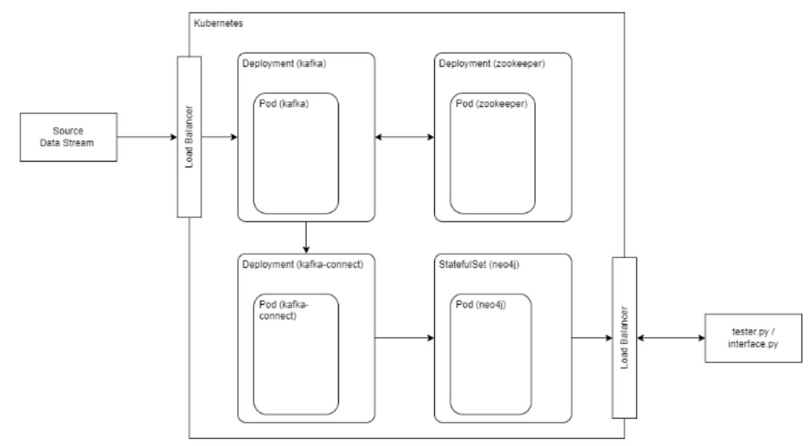

# Distributed-Graph-Streaming-System

This project demonstrates a **real-time distributed graph data processing system** using Apache Kafka, Kafka Connect, Neo4j, Docker, and Kubernetes. The system ingests New York City taxi trip events and updates a Neo4j graph database dynamically using streaming data. It reflects a real-world, scalable architecture used in modern data platforms.

## 📌 Project Overview

The goal was to extend a static batch graph processing model (Phase 1) into a live, continuously updating system (Phase 2). The system demonstrates:

- **Kafka-based event streaming**
- **Dynamic graph construction in Neo4j**
- **Microservices deployment on Kubernetes**
- **Container orchestration using Helm**

---

## 📦 Architecture

<p align="center">
  
</p>

### Components

- **Kafka Producer**: Streams real-time taxi trip events into a Kafka topic.
- **Kafka Broker & Zookeeper**: Manages message streams and coordination.
- **Kafka Connect**: Uses Neo4j Sink Connector to ingest Kafka messages into Neo4j.
- **Neo4j**: Stores dynamic graph data—nodes for pickup/dropoff locations, relationships for trips.
- **Kubernetes (Minikube)**: Orchestrates the entire system with resource-managed pods and services.

---

## ⚙️ Setup Instructions

> Make sure Docker, Minikube, and kubectl are installed.

1. **Start Minikube Cluster**
   ```bash
   minikube start --memory=8192 --cpus=4
   ```

2. **Deploy Zookeeper and Kafka**
   ```bash
   kubectl apply -f kafka/zookeeper-deployment.yaml
   kubectl apply -f kafka/kafka-deployment.yaml
   ```

3. **Deploy Neo4j with Helm**
   ```bash
   helm repo add neo4j https://helm.neo4j.com/neo4j
   helm install neo4j-release neo4j/neo4j -f neo4j/neo4j-values.yaml
   ```

4. **Deploy Kafka Connect with Neo4j Sink Connector**
   - Build/pull image: `karanshiva1996/kafka-neo4j-connect:latest`
   - Apply Kubernetes manifest:
     ```bash
     kubectl apply -f kafka-connect/kafka-connect-deployment.yaml
     ```

5. **Port Forwarding (Optional for Local Access)**
   ```bash
   kubectl port-forward svc/neo4j-release 7474:7474
   kubectl port-forward svc/kafka-connect 8083:8083
   ```

6. **Run the Data Producer**
   ```bash
   python data_producer.py
   ```

---

## 🔄 Streaming Workflow

- Events are streamed by `data_producer.py` to a Kafka topic named `tripdata`.
- Kafka Connect with the Neo4j Sink Connector continuously consumes from this topic.
- Neo4j dynamically creates:
  - Nodes: `Location` (pickup/dropoff)
  - Relationships: `TRIP` with attributes like distance, fare, timestamps.

---

## 🔍 Live Graph Queries in Neo4j

Examples:
```cypher
// Find trips between two locations
MATCH (a:Location)-[:TRIP]->(b:Location)
WHERE a.name = 'LocationA' AND b.name = 'LocationB'
RETURN a, b;

// Top locations by PageRank (requires GDS)
CALL gds.pageRank.stream('myGraph')
YIELD nodeId, score
RETURN gds.util.asNode(nodeId).name AS name, score
ORDER BY score DESC;
```

---

## 🧪 Validation and Observability

- Check pod status:
  ```bash
  kubectl get pods
  kubectl logs <pod-name>
  ```
- Ensure messages are being consumed using Kafka REST proxy or CLI tools.
- Confirm Neo4j is updating in real-time by running live Cypher queries.

---

## 📚 Technologies Used

- **Neo4j** – Graph database
- **Apache Kafka** – Event streaming platform
- **Kafka Connect** – Data integration pipeline
- **Kubernetes (Minikube)** – Container orchestration
- **Helm** – Kubernetes package manager
- **Python** – Data producer script
- **Docker** – Containerization for custom connector

---

## 🚀 Future Enhancements

- Use **Kafka Streams** or **Apache Flink** for real-time transformations.
- Scale Kafka with partitions and multiple brokers.
- Deploy Neo4j in **cluster mode** for high availability.
- Add anomaly detection logic to detect outlier trip events in real-time.

---

## 🧑‍💻 Author

**Karan S**  

---

## 📄 License

This project is for educational purposes only. Contact the author for further use.

